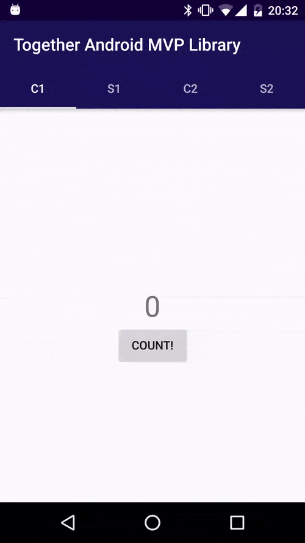

# together

Loader-based Android MVP framework supporting Dagger 2 custom scopes, based on [Tomorrow MVP][tmvp] with some inspiration from [Compartment][cmprtmnt].

## Example

This repository features an example app that demonstrates a simple Dagger 2, custom scope, fragment viewpager MVP setup.



## Include in your project

Add the maven repo url to your `build.gradle`:

```groovy
repositories {
    maven { url "https://raw.github.com/laenger/maven-releases/master/snapshots" }
}
```

Add the library to the dependencies:

```groovy
dependencies {
    compile "biz.laenger.android:together:0.0.1-SNAPSHOT"
}
```

[tmvp]: <https://github.com/michal-luszczuk/tomorrow-mvp>
[cmprtmnt]: <https://github.com/grandstaish/compartment>
